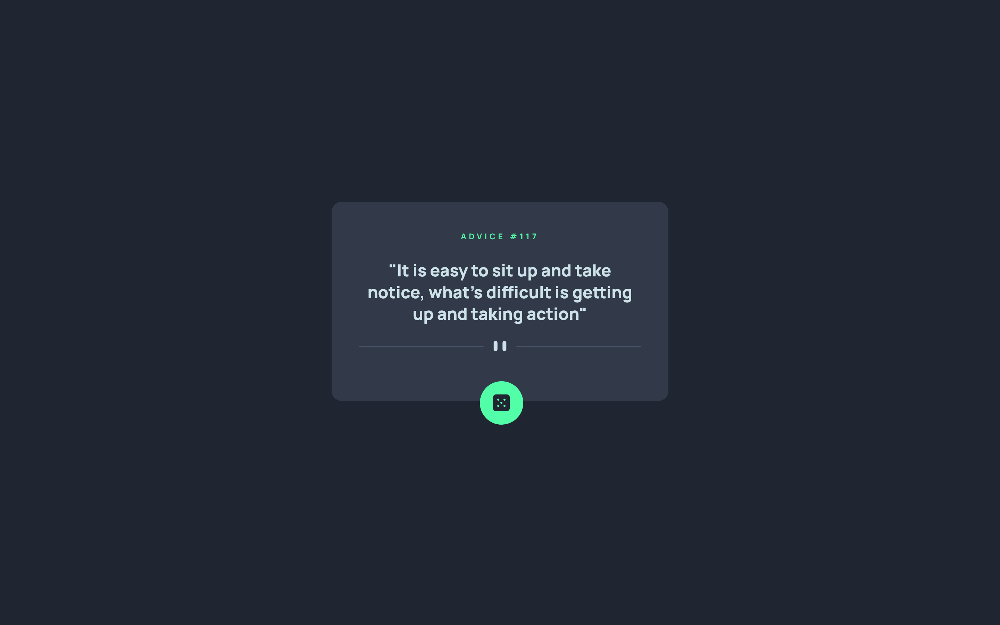
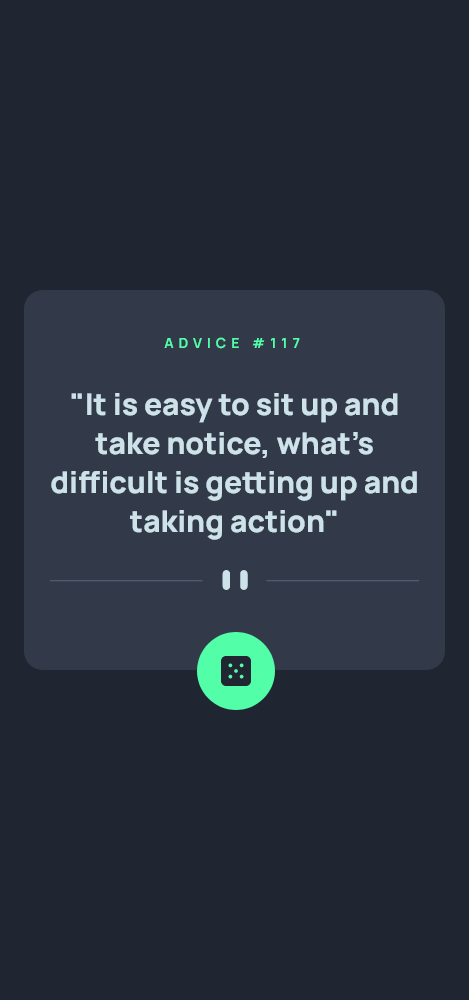

# Frontend Mentor - Advice generator app solution

This is a solution to the [Advice generator app challenge on Frontend Mentor](https://www.frontendmentor.io/challenges/advice-generator-app-QdUG-13db). Frontend Mentor challenges help you improve your coding skills by building realistic projects.

## Table of contents

- [Overview](#overview)
  - [The challenge](#the-challenge)
  - [Screenshot](#screenshot)
  - [Links](#links)
- [My process](#my-process)
  - [Built with](#built-with)
  - [What I learned](#what-i-learned)
  - [Useful resources](#useful-resources)
- [Author](#author)

## Overview

### The challenge

Users should be able to:

- View the optimal layout for the app depending on their device's screen size
- See hover states for all interactive elements on the page
- Generate a new piece of advice by clicking the dice icon

### Screenshot




### Links

- Solution URL: [Github repo](https://github.com/HectorAgValenzuela/advice-generator-app)
- Live Site URL: [Github pages](https://hectoragvalenzuela.github.io/advice-generator-app/)

## My process

### Built with

- BEM CSS
- CSS custom properties
- Flexbox
- CSS Grid
- Mobile-first workflow
- [Vue.js](https://vuejs.org/) - JS library

### What I learned

I learned about the position properties. When I wanted to place the button of the dice outside the container, I discovered the power of the positions properties

```css
/* button */
.button {
  position: absolute;
  cursor: pointer;
  top: 90%;
  left: 41%;
}
```
### Useful resources

- [How to Stack Elements in CSS](https://css-tricks.com/how-to-stack-elements-in-css/) - This helped me for positioning the button.

## Author
- Frontend Mentor - [@HectorAgValenzuela](https://www.frontendmentor.io/profile/HectorAgValenzuela)

